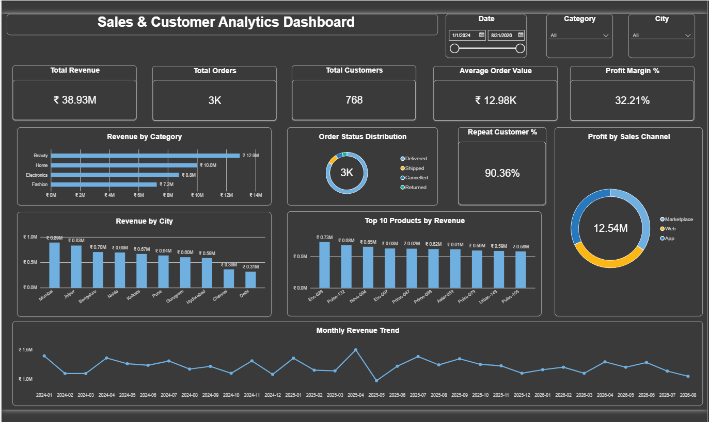

# Flagship End-to-End Analytics Project

## Project Overview

This project demonstrates a complete end-to-end Data Analyst workflow using PostgreSQL, SQL, Python, Excel, and Power BI.

The project analyzes customer, product, and order-level business data to evaluate sales performance, profitability, customer behavior, product performance, regional performance, and business trends.

The workflow covers:

Raw Data → Data Validation → SQL Analysis → Python EDA → Power BI Dashboard → Business Insights

## Business Objectives

1. Analyze overall sales, revenue, profit and order performance over time.

2. Identify top-performing and low-performing products and categories.

3. Analyze customer behavior, including high-value and repeat customers.

4. Compare performance across cities, sales channels and acquisition channels.

5. Identify business opportunities using profitability, customer and product insights.

## Dataset Overview

The project uses three relational datasets:

| Dataset | Raw Rows | Purpose |
|---|---:|---|
| Customers | 800 | Customer profile, signup, location, acquisition and loyalty information |
| Products | 150 | Product, category, pricing, cost and supplier information |
| Orders | 3,005 | Transaction-level sales, revenue, cost and profit information |

During validation, 5 exact duplicate rows were identified in the Orders dataset.

A cleaned dataset containing 3,000 order records was used for analysis.

## Data Model

The project follows a relational model:

Customers → Orders ← Products

Relationships:

- Customers[Customer_ID] → Orders[Customer_ID]
- Products[Product_ID] → Orders[Product_ID]

Power BI also includes a dedicated Date Table connected to Orders[Order_Date] for time-based analysis.

## Tech Stack

- PostgreSQL
- SQL
- Python
- Pandas
- NumPy
- Matplotlib
- Seaborn
- Power BI
- DAX
- Excel
- VS Code
- Jupyter Notebook
- Git / GitHub

## Data Validation

SQL and Python were used to validate the raw datasets before analysis.

Validation included:

- Row count verification
- NULL value checks
- Duplicate record checks
- Primary key validation
- Foreign key validation
- Orphan record checks
- Invalid numeric value checks
- Date consistency checks
- Category/text consistency checks
- Min/max range checks

### Key Data Quality Findings

- Customers contained no duplicate records.
- Products contained no duplicate records.
- Orders contained 5 exact duplicate rows.
- Raw Orders: 3,005 rows.
- Clean Orders: 3,000 rows.
- Customer and Product foreign-key relationships were valid.
- Missing Ship_Date values were investigated in relation to cancelled orders.
- Raw source tables were preserved and a cleaned Orders view was created for analysis.

## SQL Analysis

SQL was used for relational validation and core business analysis.

Analysis included:

- Overall business performance
- Monthly revenue trend
- Category performance
- Top products
- Top customers
- City performance
- Sales channel performance
- Acquisition channel performance
- Loyalty tier performance
- Repeat vs one-time customers
- Customer order frequency
- Payment mode performance
- Order status performance
- Profit margin analysis

## Advanced SQL Analysis

Advanced SQL was used only where it added business value.

Techniques included:

- CTEs
- JOINs
- CASE statements
- RANK()
- ROW_NUMBER()
- LAG()
- Window functions
- DATE_TRUNC()
- Running totals
- Contribution percentage analysis

Advanced analyses included customer revenue ranking, top product per category, month-over-month revenue growth, cumulative revenue, product revenue contribution, repeat customer contribution, and customer value segmentation.

## Python Analysis

Python was used for deeper exploratory analysis and visualization rather than simply repeating SQL analysis.

The Python workflow included:

- Dataset inspection
- Missing value analysis
- Duplicate detection and removal
- Date conversion
- Dataset merging
- Feature engineering
- Descriptive statistics
- Correlation analysis
- Customer behavior analysis
- Revenue and profit distributions
- Outlier inspection
- Segment analysis
- Business visualizations

An analysis-ready merged dataset was created by combining Orders, Customers, and Products.

## Python Visualizations

The project includes visualizations for:

- Correlation Heatmap
- Monthly Revenue Trend
- Revenue by Category
- Top 10 Products by Revenue
- Revenue Distribution
- Profit Distribution & Outliers
- Discount vs Profit
- Customer Revenue Distribution
- Repeat vs One-Time Customers
- Revenue by Customer Segment
- Profit by Sales Channel
- Profit Margin by Category
- Revenue vs Profit
- Order Quantity Distribution
- Customer Order Frequency Distribution

## Power BI Dashboard

An interactive one-page executive dashboard was created in Power BI.

### Dashboard KPIs

| KPI | Result |
|---|---:|
| Total Revenue | ₹38.93M |
| Total Orders | 3K |
| Total Customers | 768 |
| Average Order Value | ₹12.98K |
| Profit Margin | 32.21% |
| Repeat Customer Rate | 90.36% |

### Dashboard Visuals

The dashboard includes:

- Monthly Revenue Trend
- Revenue by Category
- Top 10 Products by Revenue
- Revenue by City
- Order Status Distribution
- Profit by Sales Channel
- Repeat Customer %
- Date, Category and City slicers

## Key Business Findings

Beauty was the highest revenue-generating category at approximately ₹12.9M, followed by Home at approximately ₹10M.

Electronics generated approximately ₹8.8M in revenue, while Fashion generated approximately ₹7.2M.

The business generated approximately ₹38.93M in total revenue with a profit margin of approximately 32.21%.

The analysis covered 768 purchasing customers and approximately 3,000 cleaned orders.

The repeat customer rate was approximately 90.36%, indicating that a large proportion of customers placed more than one order.

Customer, product, category, city, sales-channel, and profitability patterns were analyzed together to identify business performance opportunities.

## Business Recommendations

- Prioritize high-performing categories while investigating opportunities to improve lower-revenue categories.
- Retain and further engage high-value repeat customers through targeted loyalty strategies.
- Use product-level contribution analysis to focus marketing and inventory decisions on stronger products.
- Monitor city-level performance to identify high-potential and underperforming markets.
- Compare sales channels based on both revenue and profitability instead of revenue alone.
- Continuously monitor monthly performance to identify changes in sales momentum.

## Project Structure

Flagship_End_to_End_Analytics/

Data/
- 05_Flagship_Customers.csv
- 05_Flagship_Orders.csv
- 05_Flagship_Products.csv

Excel/
- 05_Flagship_End_to_End_Project.xlsx

SQL/
- 01_create_tables.sql
- 02_data_validation.sql
- 03_business_analysis.sql
- 04_advanced_analysis.sql

Python/
- flagship_analysis.ipynb

Power BI/
- Flagship_Analytics_Dashboard.pbix

Images/
- Flagship_Analytics_Dashboard.png
- Python analysis charts

Output/
- flagship_cleaned_merged_data.csv
- customer_summary.csv
- monthly_revenue_summary.csv

README.md

## Dashboard Preview

## How to Run

1. Load the CSV datasets into PostgreSQL.
2. Run `01_create_tables.sql` to create the database tables.
3. Run `02_data_validation.sql` for data-quality validation and creation of the cleaned Orders view.
4. Run `03_business_analysis.sql` for core business analysis.
5. Run `04_advanced_analysis.sql` for advanced analytical queries.
6. Open `Python/flagship_analysis.ipynb` and run the notebook.
7. Open `Power BI/Flagship_Analytics_Dashboard.pbix` to explore the interactive dashboard.

## Project Story

I used PostgreSQL to validate and analyze relational business data, Python and Pandas for deeper exploratory analysis, and Power BI to convert the findings into an interactive business dashboard.

Each tool had a clear role in the analytics workflow, from raw data validation to business insight generation and executive reporting.