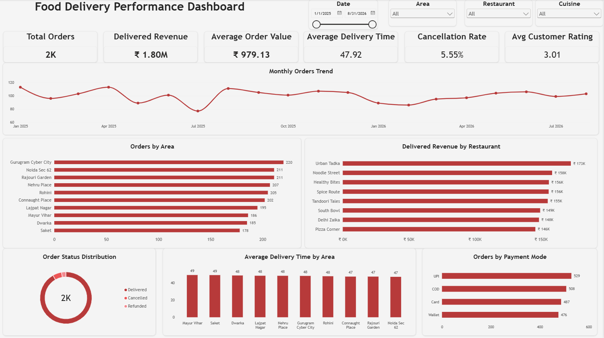

# Food Delivery Power BI Analysis

## Project Overview

This project analyzes food delivery order data using Power BI to understand order volume, delivered revenue, delivery performance, restaurant performance, area performance, payment behavior, order status, and customer ratings.

The goal of the project is to build a clean and interactive business dashboard that can help identify operational and revenue-related patterns.

---

## Tools Used

- Power BI Desktop
- Power Query
- DAX
- CSV
- Microsoft Excel

---

## Dataset Overview

The dataset contains:

- 2,000 food delivery orders
- 15 columns
- Date range: 01 January 2025 to 31 August 2026

Main fields used in the analysis:

- Order_ID
- Order_Date
- Restaurant
- Cuisine
- Area
- Distance_KM
- Prep_Time_Min
- Traffic
- Delivery_Time_Min
- Order_Value
- Delivery_Fee
- Status
- Customer_Rating
- Payment_Mode
- Customer_Type

---

## Data Cleaning

The dataset was cleaned and validated using Power Query.

Key cleaning steps:

- Checked column quality, distribution, and profiling using the complete dataset
- Verified data types for all columns
- Checked Order_ID uniqueness
- Confirmed there were 2,000 unique Order_ID values
- Identified inconsistent spaces in the Area column
- Applied Trim to the Area column
- Reduced Area values from 19 inconsistent text values to 10 clean distinct areas
- Checked missing values
- Found 476 missing Customer_Rating values
- Kept missing ratings as null instead of replacing them with zero
- Verified Customer_Rating range from 1 to 5
- Checked numeric columns for zero, negative, or suspicious values
- Verified Status values: Delivered, Cancelled, Refunded
- Verified Payment_Mode values: Card, COD, UPI, Wallet
- Verified Customer_Type values: New, Returning
- Checked Restaurant, Cuisine, Traffic, and date consistency

---

## DAX Measures

The following measures were created:

```DAX
Total Orders =
COUNTROWS(FoodDelivery)
```

```DAX
Total Order Value =
SUM(FoodDelivery[Order_Value])
```

```DAX
Average Order Value =
DIVIDE(
    [Total Order Value],
    [Total Orders]
)
```

```DAX
Average Delivery Time =
AVERAGE(FoodDelivery[Delivery_Time_Min])
```

```DAX
Delivered Orders =
CALCULATE(
    COUNTROWS(FoodDelivery),
    FoodDelivery[Status] = "Delivered"
)
```

```DAX
Cancelled Orders =
CALCULATE(
    COUNTROWS(FoodDelivery),
    FoodDelivery[Status] = "Cancelled"
)
```

```DAX
Cancellation Rate =
DIVIDE(
    [Cancelled Orders],
    [Total Orders]
)
```

```DAX
Average Customer Rating =
AVERAGE(FoodDelivery[Customer_Rating])
```

```DAX
Average Delivery Fee =
AVERAGE(FoodDelivery[Delivery_Fee])
```

```DAX
Delivered Order Value =
CALCULATE(
    SUM(FoodDelivery[Order_Value]),
    FoodDelivery[Status] = "Delivered"
)
```

```DAX
Refunded Orders =
CALCULATE(
    COUNTROWS(FoodDelivery),
    FoodDelivery[Status] = "Refunded"
)
```

```DAX
Refund Rate =
DIVIDE(
    [Refunded Orders],
    [Total Orders]
)
```

---

## Dashboard KPIs

The dashboard includes the following KPI cards:

- Total Orders: 2,000
- Delivered Revenue: ₹1.80M
- Average Order Value: ₹979.13
- Average Delivery Time: 47.92 minutes
- Cancellation Rate: 5.55%
- Average Customer Rating: 3.01

---

## Dashboard Features

The dashboard contains the following visuals:

- Monthly Orders Trend
- Orders by Area
- Delivered Revenue by Restaurant
- Order Status Distribution
- Average Delivery Time by Area
- Orders by Payment Mode

Interactive slicers:

- Date
- Area
- Restaurant
- Cuisine

---

## Key Insights

### 1. Gurugram Cyber City generated the highest order volume

**Observation:**  
Gurugram Cyber City recorded the highest number of orders with 220 orders.

**Business Meaning:**  
Customer demand is strongest in this delivery area compared with other locations.

**Recommendation:**  
Maintain sufficient delivery capacity and restaurant availability in Gurugram Cyber City, especially during peak periods.

---

### 2. Urban Tadka generated the highest delivered revenue

**Observation:**  
Urban Tadka generated approximately ₹173K in delivered revenue, the highest among the restaurants displayed.

**Business Meaning:**  
Urban Tadka is one of the strongest revenue-generating restaurants in the dataset.

**Recommendation:**  
Maintain good availability and delivery performance for this restaurant and study the factors contributing to its strong revenue performance.

---

### 3. UPI was the most frequently used payment method

**Observation:**  
UPI was used for 529 orders, followed by COD with 508 orders.

**Business Meaning:**  
Digital payment is slightly more popular than the other payment methods in the dataset.

**Recommendation:**  
Keep the UPI payment experience reliable and convenient while continuing to support COD because it also represents a large share of orders.

---

### 4. Average delivery time was approximately 48 minutes

**Observation:**  
The overall average delivery time was 47.92 minutes.

**Business Meaning:**  
A typical delivery takes close to 48 minutes, making delivery speed an important customer experience metric.

**Recommendation:**  
Monitor preparation time, traffic conditions, delivery distance, and area-level performance to identify opportunities to reduce delivery time.

---

### 5. Mayur Vihar and Saket had the highest average delivery time

**Observation:**  
Mayur Vihar and Saket showed an average delivery time of approximately 49 minutes.

**Business Meaning:**  
These areas were slightly slower than other delivery areas.

**Recommendation:**  
Review rider availability, restaurant preparation time, routes, distance, and traffic conditions in these locations.

---

### 6. Cancellation rate was 5.55%

**Observation:**  
The overall cancellation rate was 5.55%.

**Business Meaning:**  
Most orders were not cancelled, but cancellations still represent an area where operational performance can be improved.

**Recommendation:**  
Continue monitoring cancellation patterns across restaurants, areas, dates, and customer types to identify recurring issues.

---

### 7. Average customer rating was moderate

**Observation:**  
The average customer rating was 3.01 out of 5.

**Business Meaning:**  
Customer satisfaction is moderate and has room for improvement.

**Recommendation:**  
Focus on delivery speed, food quality, order accuracy, and service consistency to improve customer ratings.

---

### 8. Overall order and revenue activity was significant

**Observation:**  
The dataset contains 2,000 orders with approximately ₹1.80M in delivered revenue and an average order value of ₹979.13.

**Business Meaning:**  
The dataset provides enough transaction volume to compare performance across areas, restaurants, payment modes, and operational metrics.

**Recommendation:**  
Use high-performing areas and restaurants as benchmarks while improving operational performance in weaker segments.

---

## Business Questions Answered

This dashboard helps answer questions such as:

- How many total orders were placed?
- How much delivered revenue was generated?
- What is the average order value?
- What is the average delivery time?
- What is the cancellation rate?
- Which area generates the most orders?
- Which restaurant generates the highest delivered revenue?
- Which payment method is most frequently used?
- How are orders distributed across order statuses?
- Which areas experience higher delivery times?
- How does order volume change over time?

---

## Project Structure

```text
Food_Delivery_PowerBI_Analysis/
│
├── Data/
│   ├── 03_FoodDelivery_PowerBI_Data.csv
│   └── 03_FoodDelivery_PowerBI_Project.xlsx
│
├── Power BI/
│   └── Food_Delivery_Dashboard.pbix
│
├── Images/
│   └── food_delivery_dashboard.png
│
└── README/
    └── README.md
```

---

## Dashboard Preview

Add the dashboard screenshot here when uploading the project to GitHub.

Example:

```md

```

---

## Project Outcome

This project demonstrates practical Power BI skills including:

- Data cleaning using Power Query
- Data quality validation
- DAX measure creation
- KPI development
- Time trend analysis
- Business performance analysis
- Interactive slicers
- Dashboard design and formatting
- Converting analytical results into business insights and recommendations
```

