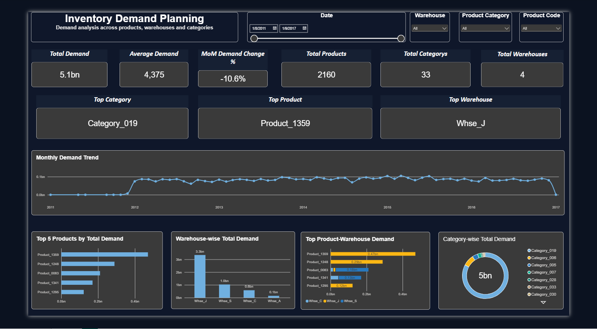

# Inventory Optimization & Demand Planning

## Project Objective
The objective of this project is to analyze historical product demand and identify high-demand products, warehouse performance, category trends, and monthly demand patterns to support better inventory planning decisions.

## Tools Used
- Excel / Power Query – Data cleaning and preparation
- PostgreSQL – Data storage and SQL analysis
- VS Code – SQL script management
- Power BI – Dashboard creation and visualization
- DAX – KPI and month-over-month calculations

## Dataset Overview
- Total Records: 1,048,575
- Date Range: January 2011 to January 2017
- Main Columns:
  - Product Code
  - Warehouse
  - Product Category
  - Date
  - Order Demand

  ## Data Validation & Cleaning
- Checked total row count and date range
- Identified missing dates in the dataset
- Identified negative demand values for further review
- Inspected repeated product-date records before removing anything
- Avoided deleting repeated rows blindly because the dataset did not contain a unique order ID
- Used Power Query for data cleaning and preparation

## SQL Analysis
The SQL analysis focused on answering key inventory and demand-planning questions.

- Identified highest and lowest demand products
- Compared warehouse-level demand
- Analyzed product-category performance
- Found top 5 products by total demand
- Analyzed monthly demand patterns
- Used CTEs for monthly and category-level analysis
- Used window functions such as LAG for month-over-month comparison
- Analyzed demand spikes and product-warehouse combinations

## Power BI Dashboard
The dashboard was created to make the SQL analysis interactive and easy to understand.

### Key Dashboard Features
- Total Demand KPI
- Average Demand KPI
- Total Products
- Total Warehouses
- Total Categories
- Top Product
- Top Warehouse
- Top Category
- Month-over-Month Demand Change %
- Monthly Demand Trend
- Top 5 Products by Demand
- Warehouse-wise Demand
- Category-wise Demand
- Top Product-Warehouse Demand
- Interactive slicers for date, warehouse, category, and product

## Key Insights
- Product_1359 had the highest total demand at approximately 470.7M units.
- Whse_J had the highest total demand at approximately 3.3B units.
- Category_019 generated the highest total demand at approximately 4.2B units.
- The latest complete month showed a -10.6% month-over-month decline in demand.
- March 2015 recorded the highest monthly demand at approximately 104.7M units.
- January 2011 recorded the lowest monthly demand with only 2 units, so this period should be reviewed as a possible partial starting month before drawing conclusions.

## Business Recommendations
- Maintain higher safety stock for high-demand products such as Product_1359.
- Prioritize capacity planning for Whse_J because it handles the highest demand.
- Closely monitor Category_019 due to its dominant share of total demand.
- Investigate sudden month-over-month demand declines before adjusting inventory levels.
- Use monthly demand trends to improve replenishment and warehouse allocation decisions.
- Validate unusually low-demand periods before making inventory decisions.

## Dashboard Preview

